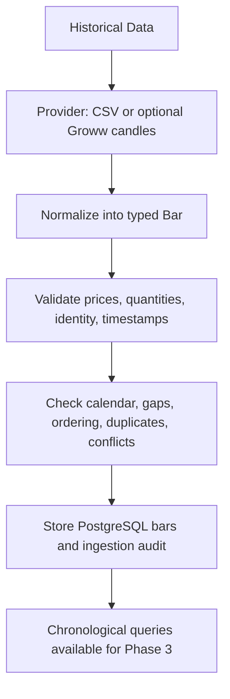

# Phase 2: Indian historical market data

India/NSE CASH is now the primary market. Phase 1 configuration, SQLAlchemy,
PostgreSQL, health/readiness, structured logging, and live-mode rejection remain.
There are no strategies, features, models, risk rules, broker execution, or orders.



## Data conventions

- A bar's `timestamp` is its **opening instant**, persisted as UTC. Phase 1's unused
  close-timestamp convention is explicitly replaced. Phase 1 had no persisted bar
  table, so no candle timestamp migration is needed.
- Session interpretation uses `Asia/Kolkata`. CSV timestamps must have an offset
  (for example `2026-01-05T09:15:00+05:30`). Only the CLI interprets an offset-free
  input range as IST. Generic domain/query inputs reject naive datetimes.
- Requests specify `[start, end)`, based on opening times; only candles completed
  by `end` are accepted/returned. Stored `available_at` records the session-aware
  closing instant. A 09:15–09:20 candle is unavailable to a 09:19 query.
- Prices are finite positive `Decimal`, persisted as `NUMERIC(28,10)`. Excess
  precision is rejected, never rounded to fit. Quantities are nonnegative signed
  64-bit integers; fractional volume, booleans, NaN, and infinity are rejected.
- `Timeframe` serializes as `1minute`, `5minute`, `10minute`, `15minute`, `30minute`,
  `1hour`, or `1day`. Durations are nominal. `NSECalendar.next_bar` accounts for
  session boundaries. Intervals anchor at session open; the final interval is
  clipped to session close. Daily candles run from session open to close.
- Exchange/segment/symbol identify an instrument. Only NSE/CASH is currently
  supported by ingestion. Symbol grammar supports NSE punctuation such as `M&M`.
  The configurable development universe is RELIANCE, TCS, INFY, HDFCBANK, ICICIBANK.
- Datasets identify `RAW`, `SPLIT_ADJUSTED`, or `FULLY_ADJUSTED`. CSV defaults to RAW.
  These are provenance declarations, **not corporate-action transformations**.
  Queries require one explicit source and adjustment policy; they never merge them.

## Calendar policy

Normal regular-session hours are 09:15–15:30 IST; pre-open and post-close data are
excluded. The pinned `pandas-market-calendars==5.4.0` NSE calendar supplies its
holiday schedule. Its inspected holiday coverage ends in 2026 and it misses some
exceptional events; it is not a live authoritative calendar service.

`config/calendar_nse.yaml` declares dependency-backed coverage for **2020–2026**,
with the existing reviewed policy beginning in 2026. Earlier years have UNKNOWN
authority and require explicit `--allow-unverified-calendar` research acceptance;
such imports retain a quality warning and unknown-authority provenance. See
[Phase 2.1 hardening](phase21-hardening.md) for the full policy. The file declares
a policy version, and source-linked corrections for the January 15 election
closure and February 1 budget Sunday session. It is a bounded correction overlay,
not an indefinitely maintained hard-coded holiday list. Requests outside its
coverage fail and are audited. Do not widen coverage without reviewing the
underlying holiday schedule and exchange circulars. Changes are traceable through
the dependency version, policy version, and policy-content hash on each run.

Exceptional sessions can be represented through explicit open/close overrides;
closures through dated overrides. Unannounced halts, per-security sessions, multiple
intraday session windows, and every future special session are not modeled.
Muhurat trading is excluded under the default regular-hours-only policy unless an
explicit reviewed override is supplied. Calendar logic is isolated behind a protocol.

References checked during implementation:

- [NSE market timings](https://www.nseindia.com/resources/exchange-communication-holidays)
- [NSE January 15 closure](https://nsearchives.nseindia.com/content/circulars/CMTR72260.pdf)
- [NSE February 1 cash-market session](https://nsearchives.nseindia.com/content/circulars/CMTR72349.pdf)
- [Calendar dependency and update limitations](https://pandas-market-calendars.readthedocs.io/en/latest/)

## Providers

`HistoricalDataProvider.fetch_bars(HistoryRequest)` yields raw rows; adapters have
no persistence or strategy responsibilities. A separate normalizer performs scalar
conversion and domain validation. Invalid numeric/OHLC values are not repaired.

**Local:** UTF-8 CSV with a strict, unique header and consistent column counts.
Required columns: `symbol,timestamp,open,high,low,close,volume`. Optional columns:
`exchange,segment,timeframe,adjustment_type,trade_count,open_interest,vwap,timestamp_convention`.
The optional timestamp convention must be `open`.
Source is always `local`; callers cannot disguise it through CSV content. A file
must describe the requested dataset. Wrong symbols, out-of-range rows, misaligned
openings, and unfinished candles are reported/rejected, not silently filtered.
Malformed file structure fails the run and inserts no candles. Parquet is not
implemented. Fixtures are tiny synthetic examples, not actual market prices.

**Groww:** optional data-only adapter calls the current
`GET /v1/historical/candles`, equivalent to `get_historical_candles`, through an
injectable `CandleClient`. The narrow standard-library HTTPS transport avoids the
full SDK's order/feed dependency surface and uses a 30-second timeout. Only this
fixed GET endpoint is implemented; no order endpoint or broker SDK is imported.
JSON prices parse directly to Decimal. Authentication uses a manually generated
access token supplied in `GROWW_ACCESS_TOKEN`; no invented API-key/secret flow.

Provider symbols (`NSE-RELIANCE`) are built inside this adapter. Documented request
limits are 30 days for 1/5 minute, 90 days for 10/15/30 minute, and 180 days for
hourly/daily data. Adjacent requests share boundaries: duplicate boundary rows flow
through the normal audit/deduplication path so conflicts cannot be hidden. The
inclusive final provider endpoint is converted to the exclusive request end.

Groww documentation does not sufficiently guarantee adjustment or opening-time
semantics. The adapter requires a complete explicit `GrowwSemantics` contract; CLI users must
pass `--groww-semantics PATH`, `--adjustment` and
`--confirm-groww-opening-timestamps`. The selected file must explicitly map timezone,
intervals, instruments, adjustment and opening labels and acknowledge UNVERIFIED
semantics. Missing mappings fail before network access. Naive Groww timestamps
are interpreted as IST at the adapter boundary. These assumptions, daily-bar labels,
and real authentication remain **UNVERIFIED**. Mock tests verify parsing, chunk
limits, boundary merging, and sanitized failures. No real Groww request was made.
Network/rate-limit failures fail the run; automatic retries and provider quotas are
future operational work. Large imports can be safely retried manually.

References: [current candles and limits](https://groww.in/trade-api/docs/python-sdk/backtesting),
[REST equivalent](https://groww.in/trade-api/docs/curl/backtesting),
[access-token authentication](https://groww.in/trade-api/docs/curl).

## Database and audit

Migration `0002_historical_data.py` upgrades `0001`. It adds exchange/segment to
instruments and replaces symbol-only uniqueness with `(exchange, segment, symbol)`.
Existing Phase 1 instruments retain their asset class/currency and receive
`LEGACY_US` rather than being mislabeled NSE. New ingestion instruments use INR and
`indian_equity`. Provider IDs do not enter generic strategy-facing schemas.

| Table | Columns / purpose |
| --- | --- |
| `market_bars` | UUID `id`, `instrument_id`, `ingestion_run_id`; UTC `timestamp`, `available_at`; `timeframe`; Decimal OHLC and optional VWAP; bigint volume, optional trade_count/open_interest; `source`, `adjustment_type`, `created_at` |
| `ingestion_runs` | UUID `run_id`; provider/exchange/segment/symbols/timeframe/adjustment; requested UTC bounds; start/completion times; status; calendar version/hash; received/valid/inserted/skipped/rejected/duplicate/conflict counts; structured JSON quality issues |

Candle uniqueness is `(instrument_id, timeframe, timestamp, source, adjustment_type)`.
An additional index orders instrument/timeframe/source/adjustment/timestamp for
range/latest queries, including multiple instruments. Database checks enforce OHLC,
nonnegative quantities, finite OHLC, supported timeframes, adjustment values, and
availability after opening. Foreign keys trace each inserted candle to its first run.

Identical duplicates (including optional fields) skip safely. Different values under
the same key produce a conflict with timestamp, symbol, differing field names and
close values. **Previously stored or first accepted observations are preserved**;
conflicting subsequent rows are rejected. First-observation preservation does not
certify that observation as correct; a conflict requires investigation before research.
No conflict is silently overwritten. New sources/adjustment policies form separate
datasets and must be selected explicitly.

Runs and their canonical dataset identity events are committed before fetching.
See [dataset identities](phase21-hardening.md#lightweight-dataset-identity). Runs
are initially RUNNING. Validated data is bounded to 100,000
received rows/expected slots per run, keeping memory and report sizes bounded.
One PostgreSQL transaction acquires a service-wide advisory lock, resolves
instruments, compares existing candles, bulk inserts batches of 1,000, and commits
the final report. Concurrent service imports therefore classify duplicates safely;
the unique constraint also protects against external writers. No transaction per bar.

Provider or write failures roll back all candle writes and attempt to mark the run
FAILED using a separate transaction. If the database is unavailable, a critical log
reports audit failure. A process crash can leave a RUNNING row; automatic abandoned-run
recovery is not implemented. Rerunning the import remains safe. The lock serializes
imports for correctness; high-throughput parallel ingestion is future scope.

Quality types cover invalid values, identical/conflicting duplicates, out-of-order
input, missing session candles, off-grid/out-of-session timestamps, empty results,
missing symbols, multiple missing candles, and failures. Completeness is measured
against the **current provider response**, not previous database coverage. Thus a
one-row conflict test also reports other requested slots missing. Three or more
missing slots produce an aggregate LARGE_GAP finding in addition to per-slot issues;
it is an absence summary, not proof of one continuous halt.

For a successful run, `received = inserted + skipped + rejected`. `valid` counts
schema/session-valid candidates, including duplicates and conflicts. `rejected`
includes invalid/off-session/conflicting rows. Failed-run counters describe attempted
processing and always report zero committed inserts. Only WARNING/ERROR/CRITICAL
issues produce COMPLETED_WITH_WARNINGS; identical duplicates alone remain COMPLETED.
FAILED exits the CLI with code 1. Rejections/warnings are reported with exit code 0.

## Commands

From the repository root, activate the environment and export `DATABASE_URL` using
the README or the existing development database instructions in `verification.md`.

```sh
python -m pip install -r requirements-dev.lock
python -m pip install --no-deps --no-build-isolation -e .
export PYTHONPATH="$PWD/src"
alembic upgrade head
alembic check
python -m trading_bot.data.import_history \
  --provider local --exchange NSE --segment CASH --symbol RELIANCE \
  --timeframe 5minute --start "2026-01-05 09:15" --end "2026-01-05 09:30" \
  --file tests/fixtures/reliance_valid.csv
```

Repeat the exact command: new inserts must be zero. Omit `--symbol` to use the
configured universe; repeat it for multiple symbols. Timeframe defaults to the typed
mapping of `bar_interval_seconds` in settings. Use `--calendar` for a reviewed
alternative calendar overlay. Reports include the persistent run UUID.

Exact Python query (within the exported environment):

```sh
python - <<'PY'
from trading_bot.config.settings import load_settings
from trading_bot.database.session import build_engine
from trading_bot.data.contracts import HistoryRequest
from trading_bot.data.import_history import parse_time
from trading_bot.data.query import HistoryQuery

engine = build_engine(load_settings())
try:
    request = HistoryRequest(
        symbols=("RELIANCE",), timeframe="5minute",
        start=parse_time("2026-01-05 09:15"),
        end=parse_time("2026-01-05 09:30"),
    )
    query = HistoryQuery(engine)
    for bar in query.get_bars(request, source="local"):
        print(bar.timestamp.isoformat(), bar.close)
    print("count:", query.get_bar_count(request, source="local"))
    print("latest:", query.get_latest_bar(request, source="local"))
    print("range:", query.get_available_range(request, source="local"))
finally:
    engine.dispose()
PY
```

`get_bars` supports multiple requested symbols and sorts by UTC opening then symbol;
`get_latest_bar` requires one symbol. All query methods share the same source,
adjustment, range, and completion cutoff. The available range is within the explicit
request bounds. This prevents partial-candle look-ahead, but does not make adjusted
vendor history point-in-time corporate-action data.

Verification commands:

```sh
TEST_DATABASE_URL="$DATABASE_URL" pytest -q
ruff check .
black --check --workers 1 .
mypy
python -m pip check
PYTHONPATH=src python scripts/demonstrate_phase2.py
```

PostgreSQL tests create/drop disposable schemas. Migration tests perform actual
upgrade → downgrade → re-upgrade and drift checks there, never downgrade your
working dataset. A manual downgrade drops Phase 2 bars/audits and is not a routine
operation; it also refuses instrument identities Phase 1 cannot represent.

Next phase: deterministic, versioned feature engineering using completed historical
candles. Phase 3 has not been started.
